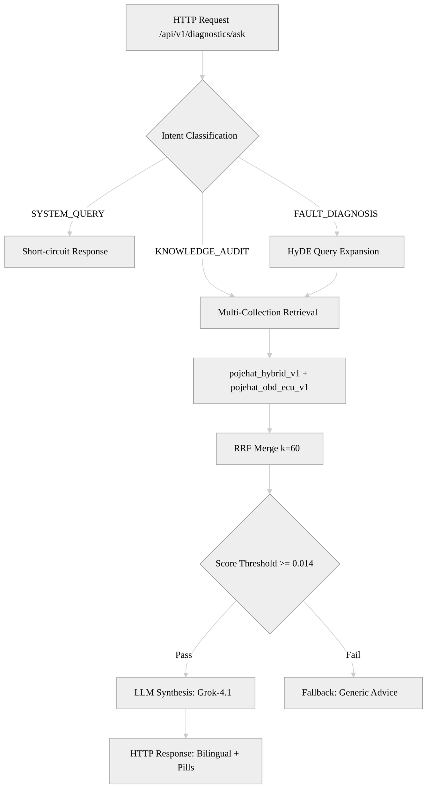
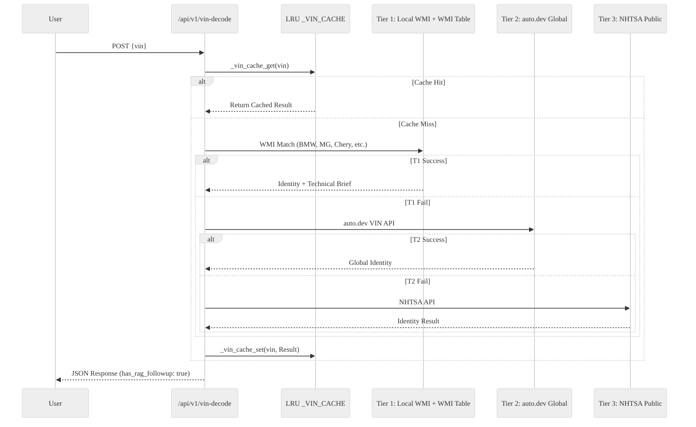

# Pojehat System Architecture

## Overview

Pojehat follows a stateless, modular architecture designed to transform colloquial automotive queries into expert-grounded diagnostic responses. The system utilizes a multi-stage pipeline that combines deterministic regional expertise with high-intelligence RAG retrieval.

## Diagnostic Pipeline Diagram



## VIN Decode: 3-Tier Enrichment Cascade

Pojehat implements a proprietary 3-tier orchestration for VIN decoding, optimized with a process-level LRU cache for high-frequency regional identify lookups.



### Tier 1: Local Identity (Instant, <1ms cache / <10ms table)

- Engine: Local _WMI_TABLE + VEHICLE_CONTEXT_MAP in vehicle_specs.py + Refactored MD Reference Corpus.
- Target: Priority Egyptian market models (Nissan, Peugeot, Toyota, Chery, MG) + Expanded VIN Logic (Hyundai, Honda, Toyota, Mercedes, Land Rover).
- Optimization: LRU Cache (500 entries) prevents redundant external API calls.

### Tier 2: Global Identity (Async, 400-800ms)

- Engine: auto.dev VIN API.
- Coverage: Global marques not covered by local priority tables.

### Tier 3: Public Fallback (Async, 1s+)

- Engine: NHTSA vPIC API.
- Role: Validates checksums and provides basic identity for North American and European imports.

## Technical Ingestion Pipeline (DBC & PDF)

The system supports high-fidelity ingestion of unstructured PDFs and structured DBC (CAN Database) files.

```mermaid
%%{init: {'theme': 'neutral', 'themeVariables': { 'primaryColor': '#ffffff', 'edgeColor': '#666666', 'fontFamily': 'Inter, sans-serif' }}}%%
graph LR
    A[Technical Sources] --> B{File Type}
    B -->|PDF| C[pymupdf4llm Parser]
    B -->|DBC| D[Custom Message Chunker]
    C --> E[LlamaIndex Document]
    D --> E
    E --> F[text-embedding-3-small]
    F --> G[Qdrant Vector Store]
    
    subgraph Collections
        G --> H[pojehat_hybrid_v1: Technical Reference Library (WMI/VIN/Manuals)]
        G --> I[pojehat_obd_ecu_v1: Protocol & Signal Data (DBC)]
    end
```

## Frontend Rendering: Double-Bubble Delivery

1. Bubble 1 (Instant): Renders identity and deterministic tech specs (Engine codes, Oil types).
2. Bubble 2 (Async): Triggered by has_rag_followup: true. Performs a surgical retrieval from obd_ecu_v1 to display wiring pinouts or TSB data.

## Security & Config

- CORS: Managed via ALLOWED_ORIGINS in .env.
- Statelessness: No server-side sessions; history and context are client-managed for maximum horizontal scalability.
