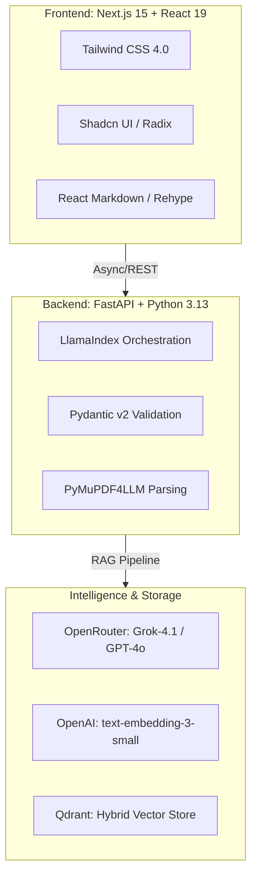

# Pojehat Technical Framework & Stack

## 🏗 High-Level Tech Stack

Pojehat is built on a modern, asynchronous architecture designed for low-latency diagnostic retrieval and high-fidelity technical synthesis.

## 🛠 Essential Backend Packages (Python)

| Category | Package | Purpose |
| :--- | :--- | :--- |
| **Web Framework** | `fastapi`, `uvicorn` | High-performance async API and server. |
| **RAG Orchestration**| `llama-index` | Core logic for indexing, retrieval, and synthesis. |
| **Vector Search** | `qdrant-client`, `llama-index-vector-stores-qdrant` | Sparse/Dense hybrid retrieval. |
| **Embeddings** | `llama-index-embeddings-openai` | Dimensional vector generation for technical data. |
| **LLM Integration** | `llama-index-llms-openrouter` | Seamless multi-model LLM access via OpenRouter. |
| **Parsing** | `pymupdf4llm` | Converting complex PDFs into structured Markdown for RAG. |
| **Validation** | `pydantic`, `pydantic-settings` | Schema enforcement and environment management. |
| **Tooling** | `uv`, `ruff` | Blazing fast dependency management and strict linting. |

## 🎨 Essential Frontend Packages (TypeScript)

| Category | Package | Purpose |
| :--- | :--- | :--- |
| **Core Framework** | `next`, `react`, `react-dom` | React 19 + Next.js 15 App Router architecture. |
| **Styling** | `tailwindcss`, `tailwind-merge` | Utility-first styling with v4.0 performance. |
| **UI Components** | `shadcn`, `radix-ui` | Accessible, unstyled primitives for premium UI. |
| **Icons** | `lucide-react` | Consistent, SVG-based technical iconography. |
| **Markdown** | `react-markdown`, `rehype-raw`, `remark-gfm` | High-fidelity rendering of technical tables and code pills. |
| **Theming** | `next-themes` | Native dark/light mode support with system sync. |

## 🚀 Key Architectural Priorities

- **Process-Level Caching**: Uses a 500-entry LRU cache to minimize external API costs and latency.
- **Statelessness**: No server-side session state, enabling infinite horizontal scalability.
- **Type Safety**: 100% type-hinted Python backend and strict TypeScript frontend.
- **Bilingual Synthesis**: Specialized prompt engineering for English technical data and Egyptian Arabic diagnostic logic.
