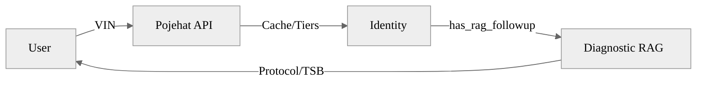

# Pojehat RAG Engine

Pojehat is an AI-driven Tier-3 automotive diagnostic engine specifically engineered for the Egyptian market. It leverages high-fidelity technical documentation and real-world OBD-II datasets to provide accurate, bilingual diagnostic assistance.

## 🚀 Key Infrastructure Upgrades (March 2026)

We have recently fortified the core intelligence layer to support deep-tier diagnostics:



- Fortified 3-Tier VIN Decoding:
  - Tier 1 (Local): Instant WMI-based identification for Egyptian priority brands + Refined MD reference tables.
  - Tier 2 (auto.dev): Global fallback for international marques.
  - Tier 3 (NHTSA): Public validation for imports.
- Global Technical Reference Library: Ingested a high-fidelity corpus of VIN breakdown maps (Hyundai, Honda, Toyota, Mercedes, Land Rover) and WMI charts into `pojehat_hybrid_v1`.
- Grounding Bar V2: Upgraded confidence visualization with 15% larger typography and enhanced responsive track designs.
- Process-Level LRU Cache: Implemented a 500-entry in-memory cache to reduce external API latency by 99% for repeat VINs.
- High-Aesthetic Frontend: Refined "Double-Bubble" system with automatic DTC pill styling and premium logo orchestration.

## 🛠 Core Capabilities

- Hybrid RAG: Combines dense vector retrieval with sparse BM25 keyword matching for surgical diagnostic accuracy.
- HyDE Query Expansion: Bridges the gap between colloquial Arabic/English queries and formal technical manuals.
- Intent-Driven Routing: Automatically optimizes processing for FAULT_DIAGNOSIS, CATALOG_LOOKUP, and KNOWLEDGE_AUDIT.
- Bilingual Synthesis: Delivers precise technical terms in English with detailed troubleshooting in Egyptian Arabic.

## 🇪🇬 Egyptian Market Vehicle Priority

The engine contains expert-verified technical specs and protocol data for:

- Nissan Sunny (B17) / Sentra
- Toyota Corolla (E210 / TNGA) / Hilux / Land Cruiser
- Peugeot 301 / Citroën C-Elysée
- Chery Tiggo 7 / Arrizo 5
- MG ZS / ZS EV / HS
- Renault Logan / Sandero / Duster
- Hyundai Accent RB / Tucson TL/NX4 / Elantra
- Kia Cerato BD / Sportage QL
- Mercedes-Benz (W204, W205, W212, W213 Technical Logic)
- Honda Civics / CR-V / Accord VIN Patterns
- Land Rover Discovery / Range Rover L322/L405 VIN Logic

## 🚦 Quick Start

1. Configure Environment:

   ```bash
   cp .env.example .env
   # Edit .env with QDRANT_URL, OPENROUTER_API_KEY, and AUTO_DEV_API_KEY
   ```

2. Install & Sync (Using uv):

   ```bash
   uv sync
   ```

3. Launch Backend:

   ```bash
   uvicorn src.app.main:app --port 8000 --reload
   ```

## 🔗 Primary API Endpoints

| Method | Endpoint | Description |
| :--- | :--- | :--- |
| POST | /api/v1/diagnostics/ask | Primary RAG diagnostic query |
| POST | /api/v1/diagnostics/vin-decode | 3-Layer VIN Decode (Bubble 1) |
| POST | /api/v1/diagnostics/vin-rag-brief | Async RAG VIN Enrichment (Bubble 2) |
| POST | /api/v1/ingestion/upload | Upload PDF manuals for vectorization |

---

Copyright © 2026 J. Servo LLC. All rights reserved.
